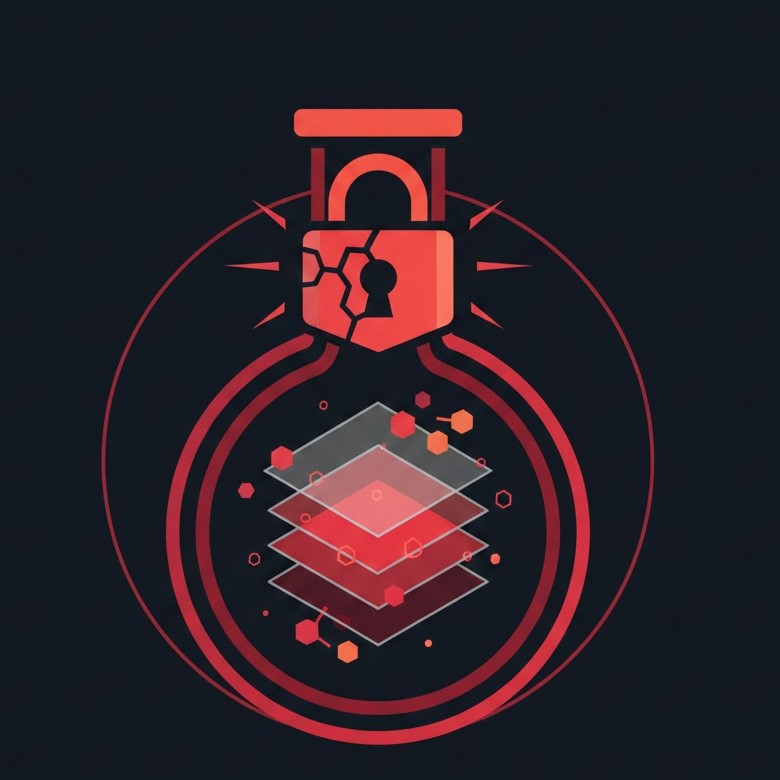

<p align="center"><a   target="_blank"></a></p>

# Damn Vulnerable Laravel Application (DVLA)

## Overview

**DVLA** is an intentionally vulnerable Laravel web application designed as an educational platform for learning about common web security vulnerabilities and their mitigation strategies. This laboratory provides hands-on experience with real-world security issues and their fixes.

## Purpose

This application serves as a teaching tool to demonstrate:
- Common web application vulnerabilities
- How attackers exploit these vulnerabilities
- Industry-standard security practices to prevent exploitation
- Different implementations of the same security solution

## Features

### 1. Path Traversal Vulnerability Lab
Demonstrates file download vulnerabilities and multiple mitigation strategies.

#### Vulnerable Endpoint: `/download`
- **Issue**: No input validation or sanitization
- **Risk**: Attackers can access arbitrary files on the server
- **Example Attack**: 
  ```
  /download?filename=../../.env
  /download?filename=../../composer.json
  ```

#### Secure Implementations

##### 1. **basename()** Approach (`/download-secure`)
- Strips directory path components
- Simple and lightweight
- Works well for basic scenarios

##### 2. **realpath()** Approach (`/download-realpath`)
- Validates the real path of the file
- Ensures the file stays within the allowed directory
- More robust against edge cases

##### 3. **Allow-list** Approach (`/download-allowlist`)
- Only permits a predefined list of files
- Most restrictive and secure
- Best practice for controlled file access

### 2. Open Redirect Vulnerability Lab
Demonstrates unsafe redirects and proper validation methods.

#### Vulnerable Endpoint: `/redirect-vuln`
- **Issue**: Redirects to any URL without validation
- **Risk**: Attackers can perform phishing attacks, credential theft
- **Example Attack**: 
  ```
  /redirect-vuln?url=http://evil.example.com/fake-login
  /redirect-vuln?url=http://phishing-site.com
  ```

#### Secure Implementations

##### 1. **Allow-list Hosts** Approach (`/redirect-safe`)
- Validates the URL structure
- Only allows specific trusted hosts
- Checks both scheme and hostname
- Recommended for external redirects

##### 2. **Relative Paths Only** Approach (`/redirect-validate`)
- Only allows relative paths (starting with `/`)
- Prevents external redirects
- Best for internal application navigation

## Technology Stack

- **Framework**: Laravel 12.0
- **PHP**: 8.2+
- **Database**: SQLite (for development)
- **Frontend**: Tailwind CSS 4.0
- **Build Tool**: Vite 7.0
- **Testing**: PHPUnit 11.5

## Project Structure

```
├── app/                    # Application code
│   ├── Http/Controllers/   # HTTP controllers
│   ├── Models/             # Eloquent models
│   └── Providers/          # Service providers
├── routes/                 # Application routes
│   └── web.php             # Web routes (vulnerable endpoints)
├── resources/
│   ├── views/
│   │   ├── lab.blade.php   # Lab interface
│   │   └── welcome.blade.php
│   ├── css/                # Tailwind CSS
│   └── js/                 # Frontend JavaScript
├── storage/
│   └── content/            # Sample files for download lab
├── database/               # Migrations and seeders
├── tests/                  # Test suites
└── public/                 # Public assets
```

## Getting Started

### Prerequisites
- PHP 8.2 or higher
- Composer
- Node.js and npm
- Git

### Installation

1. **Clone the repository**
   ```bash
   git clone <repository-url>
   cd DVLA
   ```

2. **Run **
 
   ```bash
   composer install
   php artisan serve --port=8080
   ```

 

## Usage

### Accessing the Lab

1. Open your browser and navigate to `http://localhost:8000`
2. Click on the **Lab** link to access the security laboratory
3. Interact with the vulnerable and secure endpoints

### Testing Path Traversal

1. Go to the **"Descargas - Path traversal"** section
2. Try these examples:
   - **Vulnerable endpoint**: `../../.env` (should succeed - unsafe!)
   - **Secure endpoints**: Try the same payload (should be blocked)

### Testing Open Redirect

1. Go to the **"Open Redirect"** section
2. Try these examples:
   - **Vulnerable endpoint**: `http://evil.example.com`
   - **Secure endpoints**: `http://example.com` or relative paths like `/download`

## Security Lessons

### Lesson 1: Input Validation
- **Never trust user input**
- Always validate and sanitize input before using it
- Use whitelisting (allow-list) instead of blacklisting when possible

### Lesson 2: Path Traversal Prevention
- Use `basename()` for simple filename extraction
- Use `realpath()` to validate file paths
- Implement allow-lists for sensitive file access

### Lesson 3: Redirect Validation
- Never redirect to unvalidated URLs
- Use URL parsing to validate structure
- Maintain a whitelist of allowed hosts
- Consider restricting to relative paths only

### Lesson 4: Defense in Depth
- Multiple layers of security are better than one
- Combine different validation techniques
- Follow the principle of least privilege

## Running Tests

Run the test suite:

```bash
composer test
```

This will clear the configuration cache and run PHPUnit tests.

## Available Endpoints

### File Download Endpoints

| Endpoint | Status | Description |
|----------|--------|-------------|
| `/download` | ⚠️ Vulnerable | No validation |
| `/download-secure` | ✅ Secure | Uses `basename()` |
| `/download-realpath` | ✅ Secure | Uses `realpath()` validation |
| `/download-allowlist` | ✅ Secure | Uses file allow-list |

### Redirect Endpoints

| Endpoint | Status | Description |
|----------|--------|-------------|
| `/redirect-vuln` | ⚠️ Vulnerable | No validation |
| `/redirect-safe` | ✅ Secure | Allow-list of hosts |
| `/redirect-validate` | ✅ Secure | Relative paths only |

## Files in Storage

Sample files available for download in `storage/content/`:
- `hello.txt` - Simple text file

**Note**: Additional files can be added for testing purposes.

## Development Commands

```bash
# Development server with hot reload
composer run dev

# Build for production
npm run build

# Run tests
composer test

# Format code with Pint
vendor/bin/pint

# Lint YAML files
vendor/bin/yaml-lint

# Access Laravel Tinker (interactive shell)
php artisan tinker
```

## Security Best Practices References

- [OWASP Top 10](https://owasp.org/www-project-top-ten/)
- [CWE-22: Improper Limitation of a Pathname to a Restricted Directory ('Path Traversal')](https://cwe.mitre.org/data/definitions/22.html)
- [CWE-601: URL Redirection to Untrusted Site ('Open Redirect')](https://cwe.mitre.org/data/definitions/601.html)
- [Laravel Security Documentation](https://laravel.com/docs/security)

## Important Notes

⚠️ **Warning**: This application is intentionally vulnerable. Do not use this in production or expose it to untrusted networks.

✅ **Educational Purpose Only**: This laboratory is designed for learning and development. Always follow security best practices in production environments.

## Contributing

Contributions are welcome! If you'd like to:
- Add new vulnerabilities to the lab
- Improve documentation
- Suggest additional mitigation strategies

Please feel free to open issues or pull requests.

 
## Support

For questions or issues:
1. Check the existing documentation
2. Review the inline code comments in `routes/web.php`
3. Refer to the OWASP and CWE references provided

## Changelog

### Version 1.0
- Initial release
- Path Traversal vulnerability lab with 3 mitigation strategies
- Open Redirect vulnerability lab with 2 mitigation strategies
- Interactive web interface for testing
- Comprehensive documentation
 